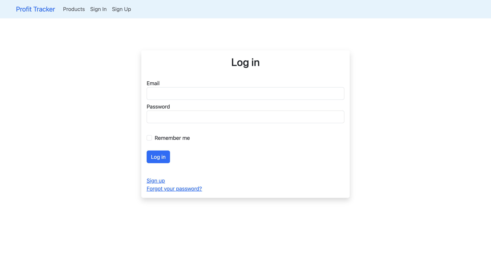
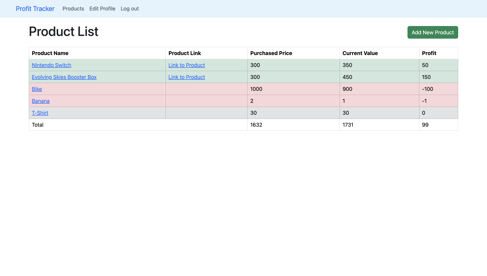

# Profit Tracker

Profit Tracker is a Ruby on Rails web application designed to help you efficiently manage your investments and track profits. Whether you're a seasoned investor or just starting, this app provides a user-friendly platform to monitor your financial progress.

## Key Features:

- **User Registration**: Users can create accounts to gain access to personalized investment tracking.

- **Investment Tracking**: Add, edit, and remove investments from your portfolio. Keep tabs on various assets and their performance.

- **Profit Summaries**: Our app calculates and displays your total profits or losses, giving you a clear overview of your financial journey.

- **Security**: We've implemented **Devise** for user authentication to ensure the privacy and security of your financial data.

- **Technologies**: The app utilizes a stack that includes **Bootstrap** for a modern, responsive design, and it supports both **SQLite** and **PostgreSQL** databases for optimal data management.

### Log in page:



### Example:



## Installation

#### MacOs:

Install Homebrew

```bash
/bin/bash -c "$(curl -fsSL https://raw.githubusercontent.com/Homebrew/install/HEAD/install.sh)"
```

Install [RVM](https://rvm.io/)

```bash
\curl -sSL https://get.rvm.io | bash -s stable --rails
```

Install Node, Yarn, and [PostgresSQL](https://wiki.postgresql.org/wiki/Homebrew)

```bash
brew install node
brew install yarn
brew install postgres@16
```

Host Server Locally, visit http://localhost:3000

```bash
rails s
```

<!-- Notes:
MVC architecture:
Model - handles database (Postgresql, SQLite, MySQL)
View - webpages
Controller - one controller for each webpage

Commands:
rails generate controller home index
rails g scaffold items product:string product_link:string bought_price:integer current_value:integer
rails db:migrate

rails generate devise:install
rails g devise:views
rails generate devise user
rails db:migrate -->
